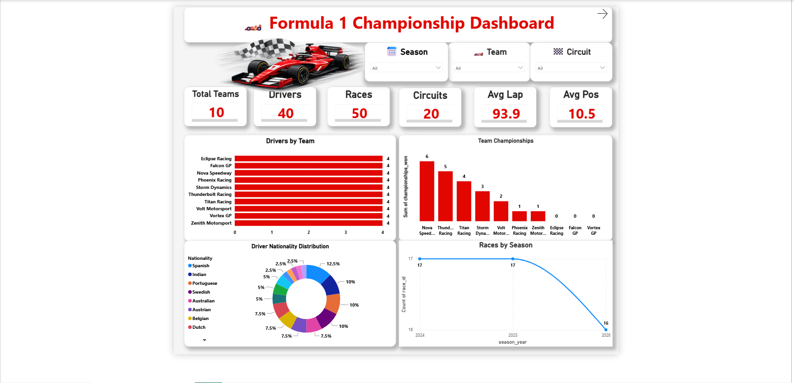
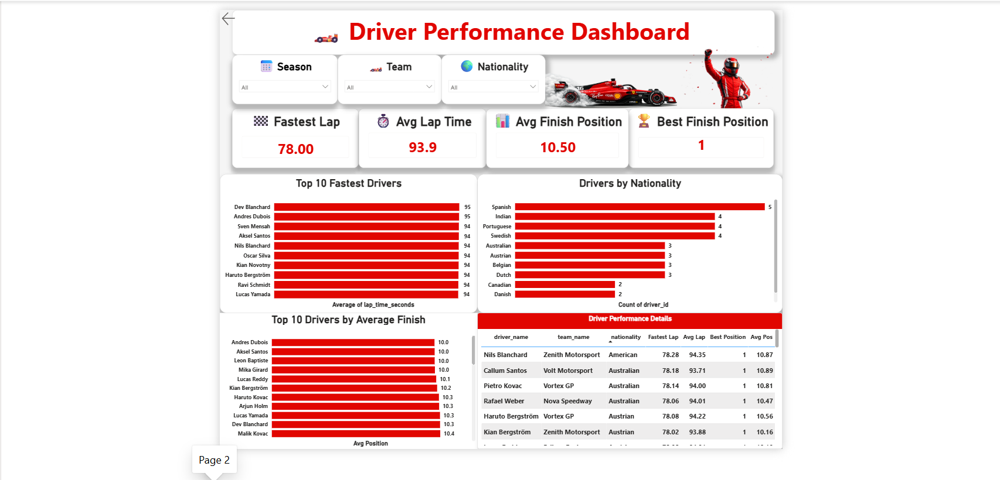

# 🏎️ ApexGP Racing Database System


A comprehensive **MySQL database project** built around a Formula-style racing championship. The project demonstrates an end-to-end data workflow — from relational database design and advanced SQL querying to live Power BI dashboarding — through **75 real-world database scenarios**.

---

## 📖 Project Overview

The **Apex Grand Prix Racing League** database is designed to manage a global racing championship involving teams, drivers, circuits, races, and lap times.

The project simulates practical, real-world database and analytics challenges, covering the full pipeline:

- Database Design & Relational Modeling
- Advanced SQL Query Writing
- Performance Optimization (Indexing & Views)
- Data Analysis & Insight Generation
- User Access Management
- **Business Intelligence Dashboarding with Power BI**

The MySQL database was connected directly to **Power BI** via the built-in MySQL connector, enabling live data refresh and interactive visualization of championship performance metrics.

---

## 📂 Repository Structure

```
ApexGP-Racing-Database-System
│
├── SQL_File
│   ├── Database_Setup.sql
│   └── Practice_Question.sql
│
├── Images
│   └── ER_Diagram.png
│
├── Insights
│   └── ApexGP_Racing_Project.pdf
│
├── PowerBi
│   ├── ApexGP_Championship_Dashboard.pbix
│   ├── Dashboard_Page1.png
│   ├── Dashboard_Page2.png
│   └── README.md
│
├── Report
│   └── ApexGP_Racing_Database_System_Report.pdf
│
└── README.md
```

---

## 🗄 Database Tables

The database consists of **5 interconnected tables**.

| Table    | Description                     |
|----------|----------------------------------|
| Teams    | Racing constructors              |
| Drivers  | Driver information               |
| Circuits | Race tracks                      |
| Races    | Championship race calendar       |
| LapTimes | Every lap recorded during races  |

---

## 🧩 SQL Concepts Covered

- DDL (CREATE, ALTER, DROP)
- DML (INSERT, UPDATE, DELETE)
- DCL (GRANT, REVOKE)
- Constraints, Primary Keys, Foreign Keys
- Aggregate Functions
- GROUP BY & HAVING
- Joins & Subqueries
- Common Table Expressions (CTEs)
- Window Functions
- CASE Statements
- Views & Indexes
- Date & String Functions
- User Privilege Management

---

## 📊 Power BI Dashboard

The database was connected to Power BI to build an interactive **Championship Dashboard**, turning raw race data into actionable insights on driver standings, team performance, and race outcomes.

### 🔗 Connecting MySQL to Power BI

1. Open **Power BI Desktop** → `Get Data` → `Database` → `MySQL Database`.
2. Enter the **server name** and **database name** of the ApexGP MySQL instance (ensure the MySQL Connector/NET or ODBC driver is installed).
3. Select **Import** or **DirectQuery** mode depending on refresh needs.
4. Choose the required tables (`Teams`, `Drivers`, `Circuits`, `Races`, `LapTimes`) or connect via custom SQL views/queries built in `Database_Setup.sql`.
5. Load the data into Power BI and build relationships in the **Model** view, mirroring the ER diagram.
6. Design visuals (standings, lap-time trends, team comparisons) across report pages.
7. Publish or export the dashboard as `.pbix`.

### 🖼 Dashboard Previews

| Page 1 | Page 2 |
|--------|--------|
|  |  |

📁 Full file: [`PowerBi/ApexGP_Championship_Dashboard.pbix`](PowerBi/ApexGP_Championship_Dashboard.pbix)

---

## 📊 Project Highlights

- ✅ 5 Relational Tables
- ✅ ER Diagram
- ✅ 75 Real-World SQL Scenarios
- ✅ Advanced SQL Queries (CTEs, Window Functions, Views, Indexing)
- ✅ User Privilege Management
- ✅ MySQL → Power BI Integration
- ✅ Interactive Championship Dashboard

---

## 🖼 Entity Relationship Diagram


---

## 📁 Project Files

| Folder        | Description                                |
|---------------|---------------------------------------------|
| **SQL_File**  | Database setup and SQL practice questions   |
| **Images**    | ER Diagram                                  |
| **Insights**  | Original ApexGP project scenario            |
| **PowerBi**   | Power BI dashboard file and screenshots     |
| **Report**    | Detailed project documentation              |

---

## 🛠 Tools Used

- MySQL 8 / MySQL Workbench
- Power BI Desktop
- DBML / DrawDB (ER diagramming)
- Git & GitHub

---

## 🎯 Learning Outcomes

This project strengthened my understanding of:

- Relational Database Design
- SQL Query Optimization & Analytical SQL
- Complex Joins, CTEs, and Window Functions
- Database Security & Performance Tuning
- Connecting SQL databases to BI tools for live reporting
- Translating raw data into business-ready dashboards

---

## 👨‍💻 Author

**Satyajit Pradhan**

- 🎓 B.Tech Computer Science & Engineering
- 📊 Aspiring Data Analyst
- 💻 Passionate about SQL, Database Design, Power BI, and Data Analytics

---

## 📬 Connect With Me

- [LinkedIn](https://www.linkedin.com/in/satyajit-pradhan-06093525b/)
- [GitHub](https://github.com/Satyajit7822)
