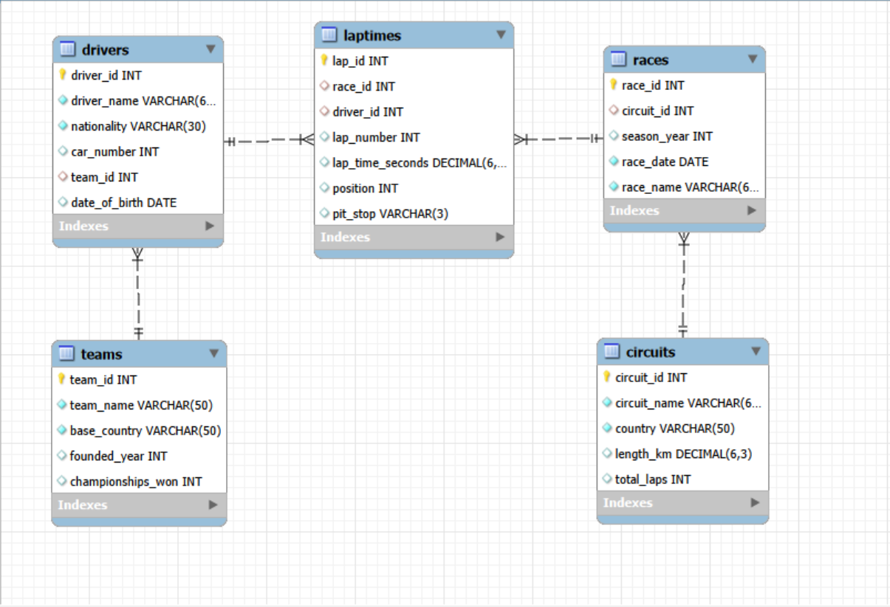

# 🏎️ ApexGP Racing Database System


A comprehensive **MySQL database project** based on a Formula-style racing championship. This project demonstrates database design, relational modeling, advanced SQL querying, indexing, views, Common Table Expressions (CTEs), window functions, constraints, and user privilege management through **75 real-world database scenarios**.

---

## 📖 Project Overview

The **Apex Grand Prix Racing League** database is designed to manage a global racing championship involving teams, drivers, circuits, races, and lap times.

The project focuses on solving practical database challenges commonly encountered in real-world applications, including:

- Database Design
- Relational Modeling
- SQL Query Writing
- Performance Optimization
- Data Analysis
- User Access Management

---

## 📂 Repository Structure

```
ApexGP-Racing-Database-System
│
├── SQL_File
│   ├── Database_Setup.sql
│   └── Practice_Question.sql
│
├── Images
│   └── ER_Diagram.png
│
├── Insights
│   └── ApexGP_Racing_Project.pdf
│
├── Report
│   └── ApexGP_Racing_Database_System_Report.pdf
│
└── README.md
```

---

# 🗄 Database Tables

The database consists of **5 interconnected tables**.

| Table | Description |
|--------|-------------|
| Teams | Racing constructors |
| Drivers | Driver information |
| Circuits | Race tracks |
| Races | Championship race calendar |
| LapTimes | Every lap recorded during races |

---

# 🧩 SQL Concepts Covered

- DDL (CREATE, ALTER, DROP)
- DML (INSERT, UPDATE, DELETE)
- DCL (GRANT, REVOKE)
- Constraints
- Primary Keys
- Foreign Keys
- Aggregate Functions
- GROUP BY & HAVING
- Joins
- Subqueries
- Common Table Expressions (CTEs)
- Window Functions
- CASE Statements
- Views
- Indexes
- Date Functions
- String Functions
- User Privileges

---

# 📊 Project Highlights

- ✅ 5 Relational Tables
- ✅ ER Diagram
- ✅ 75 Real-World SQL Scenarios
- ✅ Advanced SQL Queries
- ✅ Window Functions
- ✅ CTEs
- ✅ Views
- ✅ Indexing
- ✅ User Privilege Management
- ✅ Database Optimization

---

# 🖼 Entity Relationship Diagram

<p align="center">
  
</p>

---

# 📁 Project Files

| Folder | Description |
|----------|-------------|
| **SQL_File** | Database setup and SQL practice questions |
| **Images** | ER Diagram |
| **Insights** | Original ApexGP project scenario |
| **Report** | Detailed project documentation |

---

# 🛠 Tools Used

- MySQL 8
- MySQL Workbench
- DBML / DrawDB
- Git
- GitHub

---

# 🎯 Learning Outcomes

This project strengthened my understanding of:

- Relational Database Design
- SQL Query Optimization
- Analytical SQL
- Complex Joins
- Window Functions
- Common Table Expressions
- Database Security
- Performance Tuning
- Real-world Database Problem Solving

---

## 👨‍💻 Author

**Satyajit Pradhan**

- 🎓 B.Tech Computer Science & Engineering
- 📊 Aspiring Data Analyst
- 💻 Passionate about SQL, Database Design, Power BI, and Data Analytics

---

## 📬 Connect With Me

- [LinkedIn](https://www.linkedin.com/in/satyajit-pradhan-06093525b/)
- [GitHub](https://github.com/Satyajit7822)
